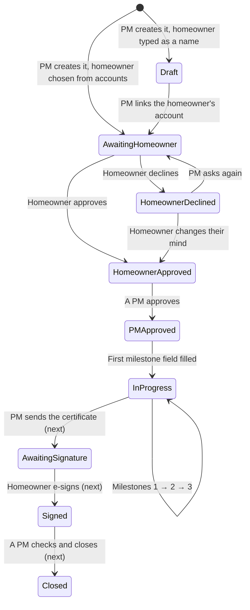

# GetHomeApps: the project process flow

How a solar installation moves through GetHomeApps, from Create Project to
handover: who does each step, what they see, who is told, and what the app
won't let happen. Each step ends with the test cases that check it using the
sample data. Built so far: everything up to **Ready for handover**. The
remaining steps are marked *(next build steps)*.

---

## 1. The people

| Role | Sees | Can do |
|---|---|---|
| **Project Manager (PM)** | Every project | Create projects and edit their details and dates. Approve projects (after the homeowner). Fill in or correct any milestone field. Reopen a completed milestone. Manage people. Read and restore the audit log. |
| **Contractor Admin** and **EPC Team** (the "crew") | Projects their contractor group is on, or that name them | Fill in every milestone field and upload its files, once the project is approved and that milestone is open. EPC also does GPS check-in *(next build step)*. |
| **Homeowner** | Their own project | Approve or decline it. See its progress and a checklist of what's done. E-sign the handover certificate *(next build step)*. |

The database enforces the same rules (migrations 0018 and 0019), so nobody can get around them by calling the API directly.

---

## 2. The status of a project



| Status | Means | Next step, and who takes it |
|---|---|---|
| **Draft** | The homeowner is only a name; they can't approve | PM: Edit the project and link the homeowner's account |
| **Awaiting Homeowner** | The homeowner has been asked to approve | Homeowner: Approve or Decline (PM can send a reminder) |
| **Homeowner Declined** | They said no, perhaps with a reason | PM: talk to them, then Ask again |
| **Homeowner Approved** | Waiting for 9 Solar Home | PM: Approve & Start Project |
| **PM Approved** | Milestone 1's fields are open | Crew: start filling in |
| **In Progress** | Work under way | Crew: complete Milestones 1, 2, 3 |
| Awaiting E-Sign / Signed / Closed | Handover *(next build steps)* | PM sends the certificate; the homeowner signs; a PM closes |

---

## 3. Step by step

### Step 1. A PM creates the project

**Projects → Create project.** Every field is required:
- **Project name.**
- **Postal code:** OneMap fills in the address, and the site's GPS point is saved for check-in.
- **Address.**
- **Homeowner:** choose their account, or type a name if they don't have one yet.
- **Homeowner contact no.**
- **Contractor:** a group, named individuals, or a typed name.
- **Start date and/or end date:** give at least one; a missing one is set 3 weeks from the other.

**Who is told:**
- The homeowner, if chosen from accounts: an in-app alert and an email asking them to approve.
- Everyone in the contractor group, or the named crew: "New project assigned".

**Status:** Awaiting Homeowner (with an account) or Draft (name only).

**Can't happen:**
- A contractor or homeowner creating a project.
- A non-homeowner account as the homeowner.
- A crew member who isn't a contractor admin or EPC.
- An end date before the start date.

**Tests:**
- **TC-01:** Create a project with Jasmine's account and Apex. It opens at Awaiting Homeowner, and Jasmine has an approval alert.
- **TC-02:** Create one with a typed homeowner name. It shows as a Draft with the info banner "No homeowner account linked".
- **TC-03:** Leave out the end date. The form shows "Runs 12 Oct → 2 Nov (end set 3 weeks after the start)".

### Step 2. The homeowner approves (or declines)

The homeowner opens their project, through the alert or by signing in. At the top is **Please approve your solar installation**, with **Approve** and **Decline**. Decline asks for an optional reason.

**Who is told:**
- Approve: the project's PM, "Approve [project]".
- Decline: the PM, with the reason.

**Status:** Homeowner Approved, or Homeowner Declined.

**Can't happen:**
- A homeowner approving someone else's project.
- A homeowner changing anything else on the project. The database refuses it.

**Tests:**
- **TC-04:** *Act as* Farah, open Hillcrest Villa, Approve. Its status becomes Homeowner Approved.
- **TC-05:** *Act as* Farah on a new project, Decline with a reason. You see the reason in your alerts as the PM. Press **Ask again** and it's back to Awaiting Homeowner.

### Step 3. A PM approves and the work opens

On a Homeowner Approved project, the PM sees **Approve & Start Project**.

**Who is told:** everyone on the project, "[project] is approved. Milestone 1 fields are open."

**Status:** PM Approved.

**What opens:**
- **Before Milestone 1:** utility bill, retailer, MOC, GST proof, the homeowner's IC last 4 and email, SP forms, SP application status.
- **Pre-end of Milestone 1:** sales, waterproofing, group chat, panel quantity and capacity, inverter, photos, current stage.
- **Milestone 1:** panel installation completion date, scaffolding, SP submission and its screenshot.

**Tests:**
- **TC-06:** On Sunbird Circle, press Approve & Start Project. Milestone 1's three sections open; Milestones 2 and 3 show "Opens once Milestone … is complete".

### Step 4. The crew fills in Milestone 1

Open a section and fill in its fields:
- **Text and numbers:** saved when you leave the box (or press Enter). A green tick confirms it.
- **Dates:** saved as soon as one is chosen.
- **Yes/No and the SP status:** saved on tap.
- **Retailer:** pick from the list or type a new one. If it isn't SP Group, "Retailer Contract End Date" appears and becomes required.
- **Inverter collected?** If No, "Expected Collection Date" appears and becomes required.
- **Homeowner's IC:** only the last 4 (e.g. 567D). It's stored privately and afterwards shows only as "Recorded".
- **Homeowner's email:** comes from their account.
- **Photos and documents:** Add photos or Upload document (photos or PDF, up to 25 MB). Tap a file to open it; × removes it, and a removed file can be restored from the audit log.

The first field saved moves the project to **In Progress**. Progress %, the section counts ("3 of 9 required") and the milestone bar update as you go.

**Can't happen:**
- A crew member outside the project editing it.
- Anyone filling in Milestone 2 before Milestone 1 is complete.
- A homeowner editing fields. They see a checklist instead.

**Tests:**
- **TC-07:** *Act as* Priya (Apex), open Jalan Kayu Residence, and fill in the rest of Pre-end of Milestone 1 and Milestone 1, including photos. Each section ticks to Done.
- **TC-08:** Set Retailer to Geneco. "Retailer Contract End Date" appears, and the section count goes up by one.
- **TC-09:** *Act as* Jasmine on Jalan Kayu. She sees a checklist with ticks, no inputs, and no way to upload.

### Step 5. Milestones complete

When every required field in a milestone's sections is filled, the app:
- records the milestone (who and when)
- opens the next milestone's fields
- tells everyone on the project ("Milestone 1 complete")
- after Milestone 3, announces **Ready for handover** to the PM, the crew and the homeowner

A completed milestone's fields are then **fixed for the crew**:
- **Correct a value:** a PM can, but can't empty a required one.
- **Allow changes again:** a PM uses **Reopen Milestone N**, which also reopens any later milestone. Reopening is logged.

**Tests:**
- **TC-10:** Finish Milestone 1 on Jalan Kayu (TC-07). Milestone 2 opens, and Jasmine and the PM get "Milestone 1 complete".
- **TC-11:** *Act as* Priya on Seletar Hills and try to change Sales. It shows a lock: "Milestone 1 is complete. A project manager can correct it or reopen the milestone."
- **TC-12:** As yourself, Reopen Milestone 1 on Seletar Hills. Priya can edit Sales again.
- **TC-13:** Punggol Waterway Terrace shows 100%, all milestones Done, and the banner Ready for handover.

### Step 6. Red projects

A project turns **red**, and is listed first under **Attention**, when either:
- it's past its target end date and unfinished, or
- an EPC visit had no check-in by the end of its day (or an hour after its start time, on the day).

Otherwise it never turns red.

**Tests:**
- **TC-14:** Seletar Hills Home is red with two reasons: "Target end date passed 9 days ago", and "No check-in for the EPC visit on … (Inverter commissioning)".
- **TC-15:** As a PM, edit Seletar's end date to a future date. The "late" reason goes; the no-show stays until a check-in exists.

### Step 7. Handover *(next build steps)*

1. The PM sends the handover certificate for e-signature (status Awaiting E-Sign).
2. The homeowner signs on any device (status Signed).
3. A PM checks the closing pack and closes the project.

### Throughout: the audit log

Every create, edit, approval, upload, removal and reopen is recorded: who, when, and the old and new value.
- **Audit → Timeline** shows changes by place and day.
- **Audit → By person** shows each person's activity.
- A PM can **Revert** a change or **Restore** an earlier value or a deleted record. This needs a reason, and is refused where it would break a milestone or a signed project.

- **TC-16:** After TC-07, open Audit. Jalan Kayu's card lists Priya's changes field by field.

---

## 4. How to run the test cases

1. **Sample data**, on the development database only (both scripts refuse production):
   ```bash
   .venv/Scripts/python.exe scripts/seed_demo.py
   .venv/Scripts/python.exe scripts/seed_flow.py
   ```
   This creates six projects, one at each stage:

   | Project | Stage | Homeowner | Crew |
   |---|---|---|---|
   | Bedok Ria Terrace | Draft (name only) | "Marcus Teo" (typed) | Northline Roofing (typed) |
   | Hillcrest Villa | Awaiting homeowner | Farah Ismail | Kim Seng M&E |
   | Sunbird Circle | PM to approve | Daniel Ong | Apex Solar |
   | Jalan Kayu Residence | In progress, Milestone 1 | Jasmine Lee | Apex Solar |
   | Seletar Hills Home | Late, with an EPC no-show | Aisha Rahman | Apex Solar |
   | Punggol Waterway Terrace | Ready for handover | Kumar Raj | Kim Seng M&E |

   Apex Solar is Priya Nair (Contractor Admin) and Ravi Kumar (EPC). Kim Seng is Priya.
2. **Run the app:** `npm run dev`, and `npm run dev:api` in a second terminal. Sign in as yourself (a PM).
3. **Act as someone else:** the demo people have no logins. To play the homeowner or crew, open **Account → Test as another account**, choose a person, and press **Start**.
   - An amber banner shows whose screens you're on. **Stop** returns you to yourself.
   - Changes are recorded as that person.
   - This only works on your computer, against a database that isn't production.
4. **Files:** until Cloudflare R2 is set up (docs/r2.md), uploads are kept in `web/.uploads/` on your computer. The flow is identical once R2 is configured.

### Automated checks

- **Python:** `npm run test:py`, 95 tests. `tests_py/test_project_work.py` walks this flow end to end:
  - create, approve, Milestone 1 and reopening
  - conditional fields, decline and ask again
  - uploads (and refused uploads)
  - the IC rule, linking a homeowner, the database's rules, and act-as
- **Front end:** `npm run test:web`.
- **Design:** `/dev-preview/design-check`, 102 checks across phone, tablet and desktop, in Black and Light.
