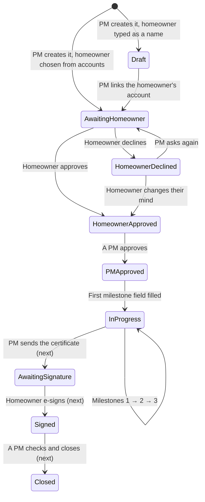

# GetHomeApps: the project process flow

How a solar installation moves through GetHomeApps, from Create Project to
handover: who does each step, what they see, who is told, and what the app
won't let happen. Each step ends with the test cases that check it using the
sample data. Built so far: everything up to **Ready for handover**, including site visits and GPS check-in. The
remaining steps are marked *(next build steps)*.

---

## 1. The people

| Role | Sees | Can do |
|---|---|---|
| **Project Manager (PM)** | Every project | Create projects and edit their details and dates. Approve projects (after the homeowner). Fill in or correct any milestone field. Reopen a completed milestone. Manage people. Read and restore the audit log. |
| **Contractor Admin** and **EPC Team** (the "crew") | Projects their contractor group is on, or that name them | Fill in every milestone field and upload its files, once the project is approved and that milestone is open. Schedule site visits. EPC also checks in and out with GPS (Sites). |
| **Homeowner** | Their own project | Approve or decline it. See its progress and a checklist of what's done. E-sign the handover certificate *(next build step)*. |

The database enforces the same rules (migrations 0018, 0019 and 0020), so nobody can get around them by calling the API directly. For GPS check-in, only the project's EPC crew can check in, as themselves, while the project is approved or in progress. Their phone's fix must be accurate to 50 m and within the site's radius (100 m unless set otherwise).

---

## 2. The status of a project



| Status | Means | Next step, and who takes it |
|---|---|---|
| **Draft** | The homeowner is only a name; they can't approve | PM: Edit the project and link the homeowner's account |
| **Awaiting Homeowner** | The homeowner has been asked to approve | Homeowner: Approve or Decline (PM can send a reminder) |
| **Homeowner Declined** | They said no, perhaps with a reason | PM: talk to them, then Ask again |
| **Homeowner Approved** | Waiting for 9 Solar Home | PM: Approve & Start Project |
| **PM Approved** | Milestone 1's fields are open | Crew: start filling in |
| **In Progress** | Work under way | Crew: complete Milestones 1, 2, 3 |
| Awaiting E-Sign / Signed / Closed | Handover *(next build steps)* | PM sends the certificate; the homeowner signs; a PM closes |

---

## 3. Step by step

### Step 1. A PM creates the project

**Projects → Create project.** Every field is required:
- **Project name.**
- **Postal code:** OneMap fills in the address, and the site's GPS point is saved for check-in.
- **Address.**
- **Homeowner:** choose their account, or type a name if they don't have one yet.
- **Homeowner contact no.**
- **Contractor:** a group, named individuals, or a typed name.
- **Start date and/or end date:** give at least one; a missing one is set 3 weeks from the other.

**Who is told:**
- The homeowner, if chosen from accounts: an in-app alert and an email asking them to approve.
- Everyone in the contractor group, or the named crew: "New project assigned".

**Status:** Awaiting Homeowner (with an account) or Draft (name only).

**Can't happen:**
- A contractor or homeowner creating a project.
- A non-homeowner account as the homeowner.
- A crew member who isn't a contractor admin or EPC.
- An end date before the start date.

**Tests:**
- **TC-01:** Create a project with Jasmine's account and Apex. It opens at Awaiting Homeowner, and Jasmine has an approval alert.
- **TC-02:** Create one with a typed homeowner name. It shows as a Draft with the info banner "No homeowner account linked".
- **TC-03:** Leave out the end date. The form shows "Runs 12 Oct → 2 Nov (end set 3 weeks after the start)".

### Step 2. The homeowner approves (or declines)

The homeowner opens their project, through the alert or by signing in. At the top is **Please approve your solar installation**, with **Approve** and **Decline**. Decline asks for an optional reason.

**Who is told:**
- Approve: the project's PM, "Approve [project]".
- Decline: the PM, with the reason.

**Status:** Homeowner Approved, or Homeowner Declined.

**Can't happen:**
- A homeowner approving someone else's project.
- A homeowner changing anything else on the project. The database refuses it.

**Tests:**
- **TC-04:** *Act as* Farah, open Hillcrest Villa, Approve. Its status becomes Homeowner Approved.
- **TC-05:** *Act as* Farah on a new project, Decline with a reason. You see the reason in your alerts as the PM. Press **Ask again** and it's back to Awaiting Homeowner.

### Step 3. A PM approves and the work opens

On a Homeowner Approved project, the PM sees **Approve & Start Project**.

**Who is told:** everyone on the project, "[project] is approved. Milestone 1 fields are open."

**Status:** PM Approved.

**What opens:**
- **Before Milestone 1:** utility bill, retailer, MOC, GST proof, the homeowner's IC last 4 and email, SP forms, SP application status.
- **Pre-end of Milestone 1:** sales, waterproofing, group chat, panel quantity and capacity, inverter, photos, current stage.
- **Milestone 1:** panel installation completion date, scaffolding, SP submission and its screenshot.

**Tests:**
- **TC-06:** On Sunbird Circle, press Approve & Start Project. Milestone 1's three sections open; Milestones 2 and 3 show "Opens once Milestone … is complete".

### Step 4. The crew fills in Milestone 1

Open a section and fill in its fields:
- **Text and numbers:** saved when you leave the box (or press Enter). A green tick confirms it.
- **Dates:** saved as soon as one is chosen.
- **Yes/No and the SP status:** saved on tap.
- **Retailer:** pick from the list or type a new one. If it isn't SP Group, "Retailer Contract End Date" appears and becomes required.
- **Inverter collected?** If No, "Expected Collection Date" appears and becomes required.
- **Homeowner's IC:** only the last 4 (e.g. 567D). It's stored privately and afterwards shows only as "Recorded".
- **Homeowner's email:** comes from their account.
- **Photos and documents:** Add photos or Upload document (photos or PDF, up to 25 MB). Tap a file to open it; × removes it, and a removed file can be restored from the audit log.

The first field saved moves the project to **In Progress**. Progress %, the section counts ("3 of 9 required") and the milestone bar update as you go.

**Can't happen:**
- A crew member outside the project editing it.
- Anyone filling in Milestone 2 before Milestone 1 is complete.
- A homeowner editing fields. They see a checklist instead.

**Tests:**
- **TC-07:** *Act as* Priya (Apex), open Jalan Kayu Residence, and fill in the rest of Pre-end of Milestone 1 and Milestone 1, including photos. Each section ticks to Done.
- **TC-08:** Set Retailer to Geneco. "Retailer Contract End Date" appears, and the section count goes up by one.
- **TC-09:** *Act as* Jasmine on Jalan Kayu. She sees a checklist with ticks, no inputs, and no way to upload.

### Step 5. Milestones complete

When every required field in a milestone's sections is filled, the app:
- records the milestone (who and when)
- opens the next milestone's fields
- tells everyone on the project ("Milestone 1 complete")
- after Milestone 3, announces **Ready for handover** to the PM, the crew and the homeowner

A completed milestone's fields are then **fixed for the crew**:
- **Correct a value:** a PM can, but can't empty a required one.
- **Allow changes again:** a PM uses **Reopen Milestone N**, which also reopens any later milestone. Reopening is logged.

**Tests:**
- **TC-10:** Finish Milestone 1 on Jalan Kayu (TC-07). Milestone 2 opens, and Jasmine and the PM get "Milestone 1 complete".
- **TC-11:** *Act as* Priya on Seletar Hills and try to change Sales. It shows a lock: "Milestone 1 is complete. A project manager can correct it or reopen the milestone."
- **TC-12:** As yourself, Reopen Milestone 1 on Seletar Hills. Priya can edit Sales again.
- **TC-13:** Punggol Waterway Terrace shows 100%, all milestones Done, and the banner Ready for handover.

### Step 6. Red projects

A project turns **red**, and is listed first under **Attention**, when either:
- it's past its target end date and unfinished, or
- an EPC visit had no check-in by the end of its day (or an hour after its start time, on the day).

Otherwise it never turns red.

**Tests:**
- **TC-14:** Seletar Hills Home is red with two reasons: "Target end date passed 9 days ago", and "No check-in for the EPC visit on … (Inverter commissioning)".
- **TC-15:** As a PM, edit Seletar's end date to a future date. The "late" reason goes; the no-show stays until a check-in exists.

### Step 7. Site visits and GPS check-in

Once a project is approved, a **PM or the crew** schedules the days the EPC team must be on site. On the project page, under **Site schedule → Schedule visit**, they pick:
- **a date** (today or later)
- **a start time** (optional)
- **the works** for that day (optional)

**Who is told, and when:**
- **When it's scheduled:** the crew, "Site visit assigned".
- **An hour before a timed visit:** the EPC crew, "Site visit in 1 hour".
- **An hour after the start, with no check-in:** the project's PM and the EPC crew, urgently, "Running late · <project>". An untimed visit counts as missed the next morning.
- **The crew checks in an hour or more late:** the project's PM, "Crew arrived 1 h 20 min late". Once per visit.

Each reminder is sent once. Reminders run every 15 minutes (`.github/workflows/visit-reminders.yml`), once `CRON_SECRET` is set.

**The EPC team** opens **Sites**, which shows:
- **On site now:** with a Check Out button.
- **Due today:** today's visits.
- **Every other site:** they can check in on any day, not only scheduled ones.

**Check In** asks for the crew count, then takes the phone's GPS. It succeeds only if:
- the fix is accurate to **50 m or better**
- the phone is within the site's radius (**100 m** unless set otherwise)
- it's an EPC crew member on the project, checking in as themselves, while the project is approved or in progress

The time comes from the server. **Check Out** works the same way, with the number of crew still on site. Every refusal reads the same to the crew: *"You're currently not receiving GPS signal, please move to a spot where you can."* The real reason is kept for the PM.

On the project page, each visit shows **Upcoming**, **Today**, **Attended** (who checked in and out, when, with how many, and how far from the site) or **No check-in**. A check-in on a day with no visit appears under "Check-ins on other days". A visit can be cancelled until someone checks in for it. After that, it's a record.

**Can't happen:**
- A contractor admin, PM or homeowner checking in.
- Checking in for someone else.
- Checking in before approval or after handover.
- Two open check-ins for one person on one site.
- Editing where or when someone arrived or left.
- Deleting a check-in.
- Cancelling a visit someone checked in for.

**Tests:**
- **TC-17:** As yourself, open Jalan Kayu → Schedule visit for tomorrow 09:00, "Inverter commissioning". It appears as Upcoming, and Priya and Ravi each get "Site visit assigned".
- **TC-18:** *Act as* Ravi (EPC) → Sites. Jalan Kayu shows under Due today. Check In with 4 crew using **Use the site's location (development only)**. It moves to On site now: "Checked in 09:41 with 4 crew".
- **TC-19:** As Ravi, Check In on a phone outdoors at a place that isn't the site. You get the GPS message, and nothing is recorded.
- **TC-20:** As Ravi, Check Out with 3 crew. On the project page the visit shows Attended: "Ravi Kumar in 09:41 (4 crew, 0 m) · out 16:30 (3 still on site)".
- **TC-21:** *Act as* Priya (Contractor Admin). Sites isn't in her menu, and on the project page she can schedule but has no Check In button.
- **TC-22:** Try to cancel the visit Ravi checked in for. It's refused: "The crew has checked in for this visit, so it stays as a record."

### Step 8. Handover *(next build steps)*

1. The PM sends the handover certificate for e-signature (status Awaiting E-Sign).
2. The homeowner signs on any device (status Signed).
3. A PM checks the closing pack and closes the project.

### Throughout: the audit log

Every create, edit, approval, upload, removal and reopen is recorded: who, when, and the old and new value.
- **Audit → Timeline** shows changes by place and day.
- **Audit → By person** shows each person's activity.
- A PM can **Revert** a change or **Restore** an earlier value or a deleted record. This needs a reason, and is refused where it would break a milestone or a signed project.

- **TC-16:** After TC-07, open Audit. Jalan Kayu's card lists Priya's changes field by field.

### Throughout: alerts

Everything above that tells someone something is an **alert**: on the
**Alerts** screen and, for anyone who turns them on, as a **phone
notification**. Both show the same alerts. Tapping either marks it read and
opens what it's about (the project, its site visits, People or Account). See
[alerts.md](alerts.md).

- **TC-23:** As yourself, open Alerts → **Turn on notifications** → **Send a test**. The notification arrives on this device. Tapping it opens Alerts.
- **TC-24:** *Act as* Ravi; Seletar's visit this morning had no check-in. After the next 15-minute run, your Alerts shows **Running late · Seletar Hills Home** in red. Tapping it opens Seletar's site visits.
- **TC-25:** *Act as* Ravi, check in at Jalan Kayu more than an hour after its visit time. You (the PM) get **Crew arrived … late**. A second crew member checking in doesn't repeat it.
- **TC-26:** **Mark all read** clears the unread count, the dot on the Alerts tab, and the app icon's badge.

### Throughout: your account

**Account** is where each person manages themselves. Every change is in the audit log.

| Setting | How it's confirmed |
|---|---|
| **Name** | Saved straight away. A PM can revert it. |
| **Email** (the sign-in) | A 6-digit code from Clerk to the new address. It isn't restored from the log, because it's the sign-in. |
| **Mobile** | A 6-digit code by **WhatsApp**, or **SMS** if WhatsApp can't deliver (or "Send by SMS instead"). Valid 10 minutes, 5 tries. The number changes only once the code is right. |
| **Password** | Current password, then the new one twice (15+ characters). Other devices are signed out. **Forgot it?** signs out and emails a reset code that only works from that inbox. |
| **Role** | "Ask" a project manager. It appears in People → Waiting for approval, beside new accounts. The PM approves (optionally a different role, or adds a group) or declines with a reason. The role change can be reverted in the audit log. |
| **Picture** | Tap the avatar → **Change picture** (cropped square, up to 5 MB) or **Remove picture**. Saved in R2 under `profiles/`. A PM can change or remove anyone's from their Profile in People; nobody else can touch someone else's. |
| **Settings → Language** | English or 简体中文. Every screen switches at once; phone notifications arrive in that language too. It follows the account to other devices. |
| **Settings → Appearance** | Light or Black, for this device. |
| **Settings → Notifications** | Pause everything (1 hour, 8 hours, until 8 am, a week), quiet hours (e.g. 22:00–07:00), whether crews running late still get through, which kinds of alert reach the phone, and which channels (phone, email, WhatsApp/SMS). Alerts always stay on the Alerts screen; these only silence the phone, email and WhatsApp. Turning phone notifications on for this device is in the same dialog. |

- **TC-27:** Change your name; Audit shows it under you, and Revert puts it back.
- **TC-28:** *Act as* Priya → Account → Mobile → Change, type a new number → **Send code**. On a laptop without WhatsApp/SMS the code shows on screen. A wrong code says how many tries are left; the right one changes the number, marked **Verified**.
- **TC-29:** *Act as* Priya → **Need a different role? → Ask** for EPC Team with a reason. As yourself, People shows **Role change · Priya Nair · Contractor Admin → EPC Team**. Approve it: she's now EPC Team, and told.
- **TC-30:** Account → Password → Change with a wrong current password. It's refused, and nothing changes.
- **TC-32:** Account → Settings → Language → **简体中文**. The menu, headers, buttons, fields, dates ("10月7日") and toasts are in Chinese, and so are messages from the server ("已保存。每项更改都在审计日志中。"). Reload: still Chinese. Switch back to English.
- **TC-33:** Account → Settings → Notifications → quiet hours **22:00 to 07:00** → Save. The row reads "Quiet from 22:00 to 07:00". *Act as* Ravi and schedule a visit for him at 23:00 tomorrow from your side: the alert is on his Alerts screen, and the delivery log shows the phone push as skipped "during their quiet hours". A **Running late** alert still gets through while "Crews running late always get through" is on.
- **TC-34:** Account → tap your picture → **Change picture**, choose a photo. It shows on Account, in the menu, and on your People card. *Act as* Priya: her Profile has no Change button on your picture. As yourself, open Priya in People → change her picture, then **Remove picture**: both are in the audit log.

### People: expiry and disabling

Every new account is given an **expiry date**, or **No expiry** is ticked;
one of the two is required, when a PM creates the account and when they
approve a request. On that day (Singapore time) the account disables
itself and can't sign in; the person sees "Your account has expired".

- **Disable** (the switch in a person's Profile) blocks sign-in straight
  away. Optionally pick **Enable again on**: it turns itself back on that day.
- **Extending the expiry** (a later date, or removing it) re-enables an
  account that expired. One a PM disabled by hand stays disabled.
- Only PMs set these. Nobody can disable or expire their own account, and
  the last active PM is never disabled automatically.
- The schedule is applied when the person signs in, when People opens, and
  every 15 minutes by the reminders job.

- **TC-35:** People → **New account** without an expiry date and with No expiry unticked: Create is refused. Tick **No expiry**: it's created.
- **TC-36:** Open Ravi → **Expires on** tomorrow → Save. His card shows "Expires …". *(To see it fire, set it in the database to yesterday and open People: he shows **Expired** and can't sign in.)* Move the date a month later: he's **re-enabled**, and told why in the toast.
- **TC-37:** Open Priya → switch **Account enabled** off, **Enable again on** next Monday → Save. She shows as Disabled with "Enables …". Switch her back on by hand: the date is cleared.
- **TC-38:** Search People for "expired" or "已到期": only expired accounts.

### My Files

**My Files** (a tab for crews; in the menu and on Account for PMs) lists
every photo and document you've uploaded, on any project, grouped by
project. Search it by file name, project, slot or type ("jalan pdf"). Tabs
filter Photos, Documents and **Removed**: files a PM or crew member took
off a project. Those are kept, and a PM can restore them from the audit log.

- **TC-31:** *Act as* Ravi → Files. His Jalan Kayu panel photos are listed. Search "inverter" narrows to the inverter photo; tapping it opens it.

**Everyone's files (PMs).** A PM's My Files has **Everyone's**: every photo
and document on every project, newest first, each with who uploaded it (with
their picture and role). The search runs on the server across file name,
project, address, slot (in English or Chinese), uploader name, email and
role, and "photo"/"pdf"/"照片"/"文件". Photos/Documents tabs count across
everything; **Show more** loads the next page.

In R2, project files are filed by **project, then type, then slot**:
`projects/{project}/images/{slot}/…` and `projects/{project}/documents/{slot}/…`.
Profile pictures are under `profiles/{person}/images/`.

- **TC-39:** As yourself → My Files → **Everyone's** → search "priya pdf": only Priya's documents. Search "照片 jalan": Jalan Kayu's photos.

---

## 4. How to run the test cases

1. **Sample data**, on the development database only (both scripts refuse production):
   ```bash
   .venv/Scripts/python.exe scripts/seed_demo.py
   .venv/Scripts/python.exe scripts/seed_flow.py
   ```
   This creates six projects, one at each stage:

   | Project | Stage | Homeowner | Crew |
   |---|---|---|---|
   | Bedok Ria Terrace | Draft (name only) | "Marcus Teo" (typed) | Northline Roofing (typed) |
   | Hillcrest Villa | Awaiting homeowner | Farah Ismail | Kim Seng M&E |
   | Sunbird Circle | PM to approve | Daniel Ong | Apex Solar |
   | Jalan Kayu Residence | In progress, Milestone 1 | Jasmine Lee | Apex Solar |
   | Seletar Hills Home | Late, with an EPC no-show | Aisha Rahman | Apex Solar |
   | Punggol Waterway Terrace | Ready for handover | Kumar Raj | Kim Seng M&E |

   Apex Solar is Priya Nair (Contractor Admin) and Ravi Kumar (EPC). Kim Seng is Priya.
2. **Run the app:** `npm run dev`, and `npm run dev:api` in a second terminal. Sign in as yourself (a PM).
3. **Act as someone else:** the demo people have no logins. To play the homeowner or crew, open **Account → Test as another account**, choose a person, and press **Start**.
   - An amber banner shows whose screens you're on. **Stop** returns you to yourself.
   - Changes are recorded as that person.
   - This only works on your computer, against a database that isn't production.
4. **Files:** on your computer, uploads go to the Cloudflare R2 **dev** bucket (`gethomeapps-dev`). On the live site they go to `gethomeapps-prod`. Automated tests keep their files in `web/.uploads/` instead, so they use no R2 requests. See [r2.md](r2.md).

### Automated checks

- **Python:** `npm run test:py`, 2,861 tests (including the settings, pictures, account-expiry and translation tests). That includes 1,081 cases for uploads and GPS location, and 1,470 for the Cloudflare R2 setup, listed in [TEST_CASES.md](TEST_CASES.md).
  - **The whole flow, in order:** `tests_py/test_full_flow.py` takes one project from creation to Ready for handover in 18 steps, with every role doing their part (see [TEST_CASES.md](TEST_CASES.md)). It runs twice: with files on the laptop, and with files in the real R2 dev bucket.
  - **R2 requests only when asked for:** a normal run uses no R2. `npm run test:r2` runs just the 39 tests that use the real dev bucket. That's about 85 requests with tiny files, all deleted afterwards, and the bucket is left empty.
  - `tests_py/test_project_work.py` covers the same flow in smaller pieces:
  - create, approve, Milestone 1 and reopening
  - conditional fields, decline and ask again
  - uploads (and refused uploads)
  - the IC rule, linking a homeowner, the database's rules, and act-as
- **Front end:** `npm run test:web`, including `tests/i18n.test.ts`: the dictionary is complete for every `T("…")` key, patterns translate server messages, notification settings, and Chinese search words.
- **Design:** `/dev-preview/design-check`, 336 checks: 28 screens and dialogs across phone, tablet and desktop, in Black and Light, in English and Chinese. Every date and time field on them is tapped to make sure its picker opens.
